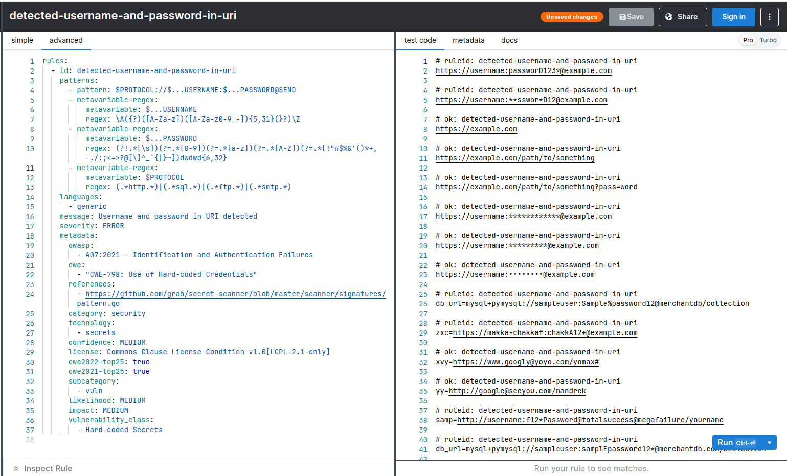
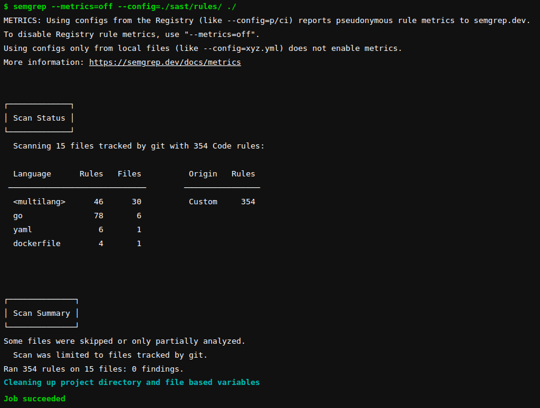
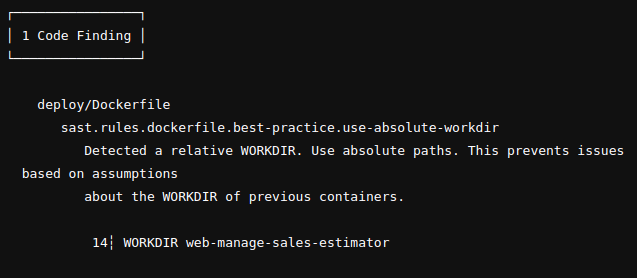

# Semgrep

Semgrep — это быстрый механизм статического анализа с открытым исходным кодом для поиска ошибок, обнаружения уязвимостей в сторонних зависимостях и обеспечения соблюдения стандартов кода. Semgrep анализирует код локально на вашем компьютере или в среде сборки.

Данный образ собран с отвязкой от серверов semgrep. Код сканируется исключительно локально. Набор правил для анализа кода расположен в данном репозитории по пути /rules

На данный момент загружены правила из открытого репозитория с полным набором бесплатных конфигов от [сообщества](https://github.com/returntocorp/semgrep-rules) и [разработчиков](https://semgrep.dev/explore) semgrep.

Правила можно обновлять, дополнять, удалять и добавлять. Для этого можно воспользоваться специальной утилитой [playground](https://semgrep.dev/playground/new), которая позволяет в формате IDE настраивать свои правила и анализирвоать как они применяются на правой половине окна.

Что можно обнаружить:

* Уязвимости безопасности - уязвимости, такие как инъекции SQL, XSS, небезопасные вызовы функций, использование устаревших алгоритмов шифрования и т.д.

* Ошибки в коде - например, можно обнаружить неправильное использование операторов, дублирование кода, проблемы с памятью. А также ошибки стиля: неправильное форматирование кода, использование лишних пробелов и табуляции, неправильное использование комментариев.

* Проблемы производительности, такие как медленные запросы к базе данных, ненужные вычисления, длинные циклы.

Semgrep может сканировать код на различных языках программирования, включая Python, Java, JavaScript, Go, Ruby, PHP, C++, C#.

### Встраивание в CI/CD

Подключить SAST можно стандартным методом includes. Запуск анализа кода происходит при MR в ветку dev. Отчёт генерится в стандартном выводе лога pipeline.
В отчёт входит срез строки с ошибкой или иным замечанием, указанием какой файл вызвал исключение и описание причины и возможных последствий с рекомендацией по устранению события.

Пример встраивания SAST-semgrep в CI/CD:
```
include:
  - project: 'web/sast'  
    ref: 'ruleset'
    file: 'deploy/sast.yml'
    rules:
      - if: $CI_MERGE_REQUEST_TARGET_BRANCH_NAME == "develop"
  
```
